# Planificación: Implementación con Safe (6 semanas)

## Contexto

Wallet hereditaria con Safe es una wallet de herencia digital. El plan original usaba ERC-4337 puro con un `InheritanceModule` custom. Los tutores del proyecto de empresa piden reutilizar **Safe** como infraestructura de smart account.

Al realizar el desarrollo de forma individual, el cronograma se extiende a **6 semanas**, permitiendo abordar de manera secuencial los distintos componentes del sistema: Smart Contracts, Backend/Oráculo, Frontend e Integración.

**Qué cambia con Safe:**

- La smart account no se construye desde cero; se despliega una **Safe Account** estándar
- El `InheritanceModule` pasa a ser un **Safe Module** (implementa la interfaz `ISafe`)
- El quórum de herederos se gestiona a nivel de módulo (o aprovechando el multisig nativo de Safe)
- Las transacciones gasless de herederos usan el **Safe Relay Kit** (ERC-4337 / Gelato) en vez de un Paymaster custom
- La coordinación de firmas entre herederos usa el **Safe Transaction Service** vía **API Kit**

**Stack Safe utilizado:**

| SDK                         | Uso                                                    |
| --------------------------- | ------------------------------------------------------ |
| `@safe-global/protocol-kit` | Desplegar Safe account, instalar/desinstalar módulo    |
| `@safe-global/api-kit`      | Coordinar firmas entre herederos (Transaction Service) |
| `@safe-global/relay-kit`    | Transacciones gasless para herederos                   |
| Contrato Safe (on-chain)    | Smart account del titular + multisig                   |

---

## Reparto de roles y dedicación

Todo el proyecto es desarrollado por **un único desarrollador**, distribuyendo el trabajo de forma progresiva.

```mermaid
gantt
    title Plan de Trabajo (6 Semanas - 1 Desarrollador)
    dateFormat  X
    axisFormat %d
    section Smart Contracts
    Setup y Esqueleto del Módulo (S1) :active, s1, 0, 7
    Lógica Core y Tests Foundry (S2)  :active, s2, 7, 14
    section Backend
    Setup y Validación PKI (S3)       :active, s3, 14, 21
    Integración Safe API Kit (S4)     :active, s4, 21, 28
    section Frontend
    Desarrollo UI y Safe SDKs (S5)    :active, s5, 28, 35
    section Integración
    Integración E2E y Demo (S6)       :active, s6, 35, 42
```



---

## Semana 1 — Configuración y Smart Contract Base

### Objetivos:

- Familiarizarse con la interfaz de Safe Modules.
- Inicializar el entorno de desarrollo smart contracts.
- Implementar la estructura inicial del módulo.

### Tareas:

- Leer: Safe Module interface (`ISafe`, `IModule`) en docs.safe.global/advanced/smart-account-modules
- Inicializar proyecto Foundry: `forge init contracts/`
- Crear stub `InheritanceModule.sol` con estructura de datos y funciones vacías: `configureInheritance`, `submitProofOfLife`, `initiateClaim`, `signClaim`, `executePayout`, `cancelClaim`
- Desplegar Safe de prueba en Sepolia para validar que el módulo se puede instalar
- Documentar el flujo y la estructura del contrato en base a la especificación técnica.

**Entregable:** Proyecto Foundry inicializado, contrato base compila y primer Safe de prueba desplegado en Sepolia con el módulo instalado/instalable.

---

## Semana 2 — Lógica Core de Smart Contracts & Tests

### Objetivos:

- Completar el desarrollo del contrato inteligente.
- Desarrollar la suite de tests automatizados.

### Tareas:

- Implementar lógica completa de `InheritanceModule.sol`:
  - `configureInheritance()` — validar pesos (BPS 10000), quórum, certificado no expirado, solo oráculo
  - `submitProofOfLife()` — actualizar timestamp, cancelar claim abierto
  - `initiateClaim()` — verificar inactividad > threshold, iniciar grace period
  - `signClaim()` — registrar firma, contar quórum
  - `executePayout()` — distribuir ETH + ERC-20 proporcionalmente, desinstalar módulo
  - `cancelClaim()` / `uninstallModule()` / `revalidateCertificate()`
- Escribir **tests Foundry** (según `docs/especificacion-tecnica.md`):
  - `test_ConfigureInheritance_Valid/InvalidWeights/QuorumTooHigh`
  - `test_SubmitProofOfLife_UpdatesTimestamp/CancelsClaim`
  - `test_InitiateClaim_BeforeThreshold_Fails/Valid`
  - `test_SignClaim_Counts`, `test_ExecutePayout_*`, `test_CancelClaim_*`
- Desplegar y verificar `InheritanceModule.sol` en Sepolia.

**Entregable:** Smart Contract definitivo desplegado y verificado en Sepolia + suite de 15+ tests unitarios pasando.

---

## Semana 3 — Backend / Oráculo (Setup y PKI)

### Objetivos:

- Inicializar el entorno del backend.
- Implementar la validación criptográfica de certificados.

### Tareas:

- Inicializar proyecto Node.js 20 + TypeScript: `backend/`
- Configurar dependencias de criptografía y ethers.
- Implementar validación PKI real con OpenSSL (parsear certificado X.509, verificar firma del notario / emisor de confianza).
- Crear endpoints mock de API para facilitar el testing.

**Entregable:** Servidor backend estructurado, endpoint de validación PKI operativo contra certificados reales de prueba.

---

## Semana 4 — Backend / Integración con Safe API Kit

### Objetivos:

- Conectar el backend con Safe Transaction Service.
- Completar la lógica de creación y firma de transacciones de Safe.

### Tareas:

- Instalar y configurar `@safe-global/api-kit` en el backend.
- Conectar `api-kit` a Sepolia Transaction Service.
- Implementar `POST /oracle/configure` que:
  1. Valida el certificado PKI recibido
  2. Construye la tx `configureInheritance()` con el ABI del módulo
  3. Propone la tx a la Safe vía API Kit (`safeApiKit.proposeTransaction`)
- Implementar `POST /oracle/revalidate` para renovación de certificado.
- Documentar la API con OpenAPI / Swagger.

**Entregable:** Endpoints del oráculo operativos y proponiendo transacciones reales en el Transaction Service de Safe Sepolia.

---

## Semana 5 — Frontend & Integración con Safe SDKs

### Objetivos:

- Crear la interfaz de usuario.
- Integrar Safe SDKs en el cliente web.

### Tareas:

- Inicializar proyecto React 18 + TypeScript + Vite: `frontend/`
- Instalar `@safe-global/protocol-kit`, `@safe-global/relay-kit`, `wagmi`, `viem`
- Configurar conexión de wallet (MetaMask / WalletConnect) mediante wagmi.
- Implementar pantallas principales:
  - **Inicio / Mi Safe**: Conectar wallet y ver estado de la Safe Account.
  - **Registrar Herencia**: Subir certificado PKI y conectar con el backend (`/oracle/configure`).
  - **Mis Herederos**: Listar beneficiarios, pesos y tiempos configurados en el módulo.
  - **Proof of Life**: Ejecutar fe de vida (`submitProofOfLife()`) de forma gasless mediante el Relay Kit.
  - **Reclamar Herencia**: Iniciar reclamación, ver firmas acumuladas y firmar reclamaciones abiertas vía API Kit.

**Entregable:** Aplicación frontend conectada a testnet, permitiendo realizar los flujos principales.

---

## Semana 6 — Integración E2E, Pruebas y Demo

### Objetivos:

- Conectar todas las piezas (Frontend, Backend, Contratos).
- Realizar pruebas integrales y preparar la entrega.

### Tareas:

- Conectar frontend con backend oráculo y módulo deployado.
- Validar el flujo E2E completo:
  - Subida de certificado → Configuración por Oráculo en Safe.
  - Simulación de inactividad → Inicio de reclamación por heredero.
  - Firma del reclamo y ejecución final de la herencia (gasless/relayed para el heredero ejecutor).
- Resolver fallos de integración detectados.
- Añadir documentación final (READMEs, diagramas de arquitectura refinados y NatSpec completo).
- Grabar video demostrativo de 5 minutos recorriendo el flujo de usuario.

**Entregable:** Sistema completamente integrado y operativo en Sepolia, documentación de entrega y video demo.

---

## Dependencias de desarrollo temporal

Al trabajar en solitario, el desarrollo sigue un camino crítico estrictamente lineal, lo que minimiza problemas de integración:

```
S1-S2: Smart Contracts desplegados y verificados
          ↓
S3-S4: Oráculo y API Kit funcionando contra Sepolia
          ↓
S5: Frontend consume API del oráculo e interactúa con el contrato
          ↓
S6: Pruebas de integración E2E, documentación y demo
```

---

## Estructura de archivos

El proyecto mantiene la siguiente estructura:

```
contracts/
  src/InheritanceModule.sol          ← Código del smart contract
  test/InheritanceModule.t.sol       ← Tests Foundry
  deployments/sepolia.json           ← ABI y address del módulo en Sepolia

backend/
  src/oracle.ts                      ← Lógica del servidor oráculo y API Kit
  src/pki-validator.ts               ← Validación de certificados X.509
  openapi.yaml                       ← Definición de la API

frontend/
  src/pages/RegisterInheritance.tsx  ← Formulario de registro y subida de certificado
  src/pages/ClaimInheritance.tsx     ← Pantalla de reclamación para herederos
  src/hooks/useSafe.ts               ← Hook de interacción con Safe Protocol Kit
  src/hooks/useInheritanceModule.ts  ← Hook de interacción con el módulo custom
```

---

## Verificación final

1. `forge test --fork-url $SEPOLIA_RPC` → todos los tests Foundry en verde
2. `curl -X POST /oracle/configure` con cert PKI de prueba → tx propuesta en Safe Transaction Service
3. Frontend → conectar MetaMask Sepolia → subir cert → ver herederos configurados on-chain
4. Simular inactividad (threshold de prueba) → heredero inicia y firma reclamación gasless
5. `executePayout()` → verificar en Sepolia Etherscan que ETH se distribuyó en proporción correcta
